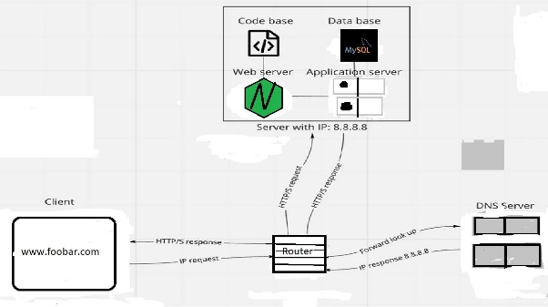



**What is a server?**

A server is a powerful computer that provides services and resources to other computers known as clients over a network

**Role of the domain**

A domain name, like foobar.com, is a human-readable address used to identify resources on the internet. It serves as a more user-friendly alternative to IP addresses.

**What type of DNS record www is in www.foobar.com?**

The “www” DNS record is a subdomain of the main domain foobar.com. It is a type of DNS record called CNAME(Canonical Name) record. It is used to associate the “www” prefix to the main domain, directing users to the same server for both www.foobar.com and foobar.com.

**What is the role of the web server?**

The web server's role is to receive incoming requests from users' browsers and serve them with the appropriate web content.

**What is the role of the application server?**

The application server is responsible for running the application code that generates dynamic content for the website. It processes requests from the web server, executes the necessary application logic, and communicates with the database to retrieve or store data.

**What is the role of the database?**

The database stores and manages the website's structured data, such as user accounts, articles, and other information.

Protocol) over the internet. When the user types www.foobar.com in their browser, the browser sends an HTTP request to the server, which processes the request and sends back an HTTP response. containing the web page's content.

ISSUES WITH THE INFRASTRUCTURES Single Point of Failure (SPOF):

Having only one server means that if it fails, the entire website becomes unavailable. To mitigate this, redundancy measures like using multiple servers in a load-balanced configuration could be implemented.
